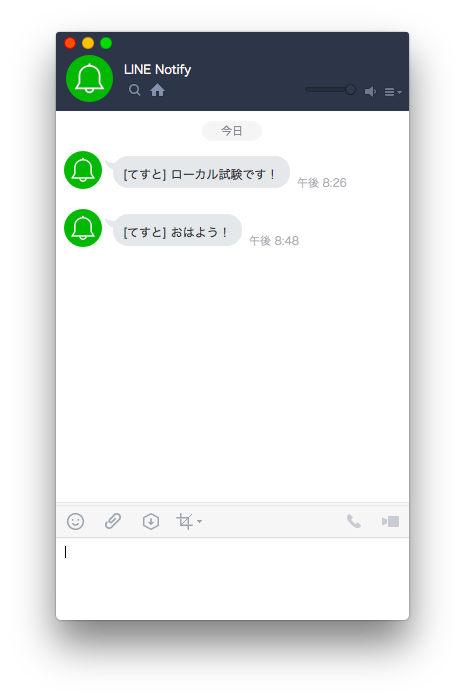

# AWS IoT ButtonからLINEに通知

AWS IoT Buttonを押したらLINEにメッセージを通知するスクリプトです。  
フロー：AWS IoT Button-> Lambda-> LINE API-> LINEアプリ

*Read this in other languages: [English](README.md), [日本語](README.ja.md).*

## まず最初に
1. LINEにログインしてアクセストークンを発行する。
https://notify-bot.line.me/ja/
2. Node.jsをダウンロードしてインストールする。
https://nodejs.org/download/release/v8.1.0/
3. 本リポジトリをクローンする。
4. ``npm install`` を実行して依存ライブラリをインストールする。

## ローカルPCからテストする
1. AWS CLIをダウンロードしてインストールする。
2. AWS IAMでアクセスキーを発行する。
3. AWS CLIでアクセスキーを登録する。
```
$ aws configure
```
4. スクリプトを実行する。
```
$ export LINE_TOKEN=<LINEのアクセストークン>
$ node index.js
```

## AWSからテストする
1. Lambda関数を作成する。
2. ソースをZIP圧縮する。 (index.js, package.json, node_modules)
3. Lambda関数にZIPファイルをアップロードする。
4. 環境変数を設定する。 (LINE_TOKENに<LINEのアクセストークン>を設定)
5. テストイベントを設定する。
```
{
  "serialNumber": "XXXXXXXXXXXXXXXX",
  "batteryVoltage": "2000mV",
  "clickType": "SINGLE"
}
```
6. テストを実行する。

## AWS IoT Buttonから実行する
1. デバイスを設定する。 (Wi-fi, デバイス証明書, プライベートキー)
https://docs.aws.amazon.com/ja_jp/iot/latest/developerguide/configure-iot.html
2. IoT 1-Clickプロジェクトを作成してLambdaと関連づける。
3. デバイスのボタンを押す。

## サンプル


## 組み込み
* [axios](https://github.com/axios/axios) - HTTP クライアント

## 著者
* 角倉 優一

## ライセンス
このプロジェクトはMITライセンスの下でライセンスされています - 詳細については、[LICENSE.md](LICENSE.md)ファイルを参照してください。
